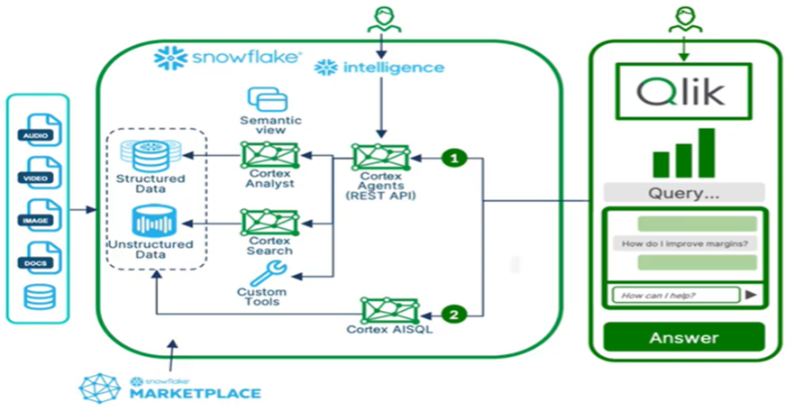

# Qlik + Snowflake + Cortex Integration

## About This Repository

The AI landscape feels overwhelming. Snowflake's Cortex capabilities are powerful, but how do you actually deliver that power to your Qlik users? 

This repository breaks down the Qlik + Snowflake + Cortex integration into three clear paths: understand the business value, see what's architecturally possible, and learn how to build it yourself. No hype. Just practical guidance to help you become the hero of your own company's AI story.

---

## Getting Started

Choose your path based on what you need to know:

### [Show Me What's Possible](show-me-whats-possible.md)
Explore the business value and real-world use cases for integrating Qlik with Snowflake Cortex. Perfect for understanding what this technology can do for your organization.

### [Show Me How It Works](show-me-how-it-works.md)
Dive into the architecture, design patterns, and technical concepts that make this integration work. Understand the components and how they fit together.

### [Show Me How to Build It](show-me-how-to-build-it.md)
Hands-on technical implementation guides with code, configurations, and step-by-step instructions. Build it yourself.

---

## About

Created by Dalton Ruer

*Let's make it simple.*
